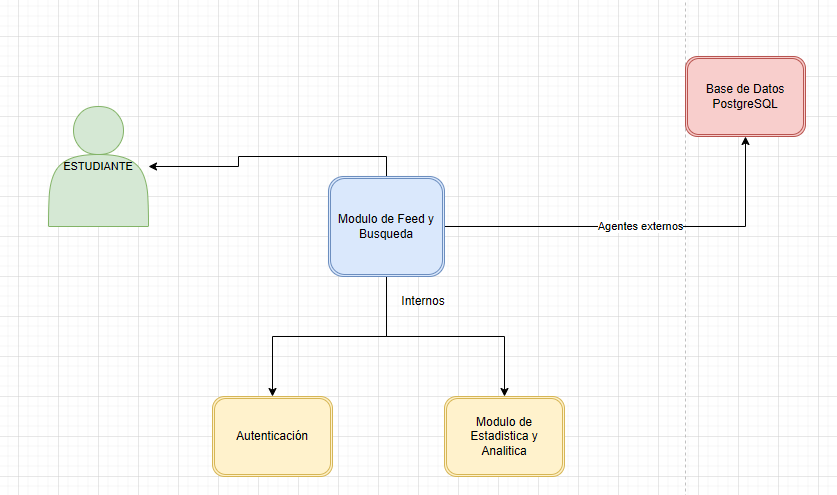
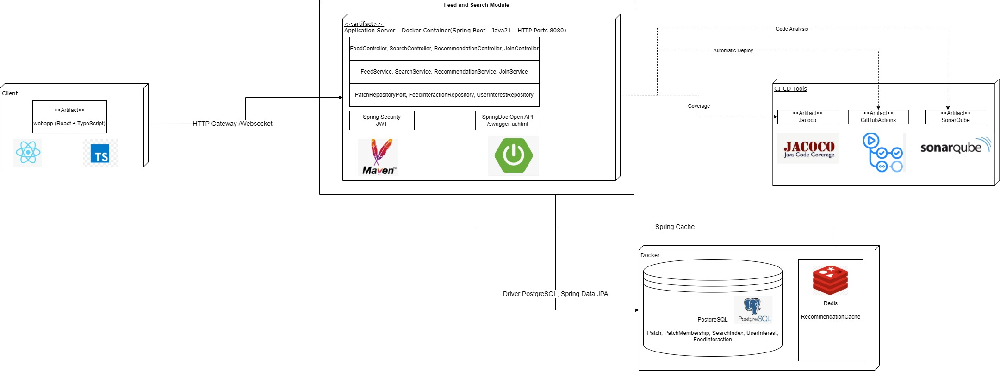

# Mewtwo_Code Feed y BusquedaPATRIC.IA

Modulo encargado de manejar los filtros de busqueda de parches y muestra las preferencias del usuario al momento de elegir actividades y 
sus preferencias.

# Miembros
- Juan David Gómez
- Adrian Ducuara
- Juan Esteban Rodríguez
- Diego Rozo
- Fabian Andrade

# Objetivo del modulo
Se usa la estructura hexagonal en conjunto con "Clean Code" donde 

# Funcionaliadades principales

| Funcionalidad            | Descripción                                                                     |
|--------------------------|---------------------------------------------------------------------------------|
| Feed Personalizado       | Listado paginado de parches ordenado por relevancia:                            |
| Busqueda y filtrado      | Búsqueda full-text con filtros combinables por categoría, fecha, zona y estado. |
| Recomendación de parches | Motor de recomendación de parches a escoger                                     |
| Unirse desde el Feed     | Permite unirse a un parche público con cupo disponible directamente desde el feed                                                                               |

# Manejo de Estrategia de versionamiento y ramas

## Ramas y propósito

- main: Rama estable con la versión final 
- develop: Rama de integración continua de trabajo y base de nuevas funcionalidades
- feature/*: Rama de desarrollo de funcionalidades 

# Tecnologias a usar
- Java21 + SpringBoot - Framework Principal
- PostgreSQL - Persistencia (Base de datos)
- Redis - Caché de recomendaciones
- Spring Security + JWT - Autenticación y seguridad
- GitHub Actions - Pipelines de integración y despliegue continuo (CI/CD) 
- Jacoco - Cobertura de pruebas unitarias
- Swagger - Documentación API 
- Docker - Contenerización de cada microservicio
- Mockito - Simulación de dependencias en pruebas unitarias
- Maven - Gestión de dependencias y empaquetado de cada microservicio

# API ENDPOINTS

## GET /api/feed
Feed personalizado

| Parámetro | Tipo    | Descripción                             |
|-----------|---------|-----------------------------------------|
| page      | Integer | Numero de pagina (siempre arranca en 0) |
| size      | Integer | Tamaño del feed                         |

## GET /api/feed/search
Busqueda de parches

| Parámetro       | Tipo     | Descripción                                              |
|-----------------|----------|----------------------------------------------------------|
| category        | Enum     | Las actividades permitidas que desean realizar en parche |
| campusZone      | Enum     | Zonas para compartir                                     |
| dateFrom        | Date ISO | Fecha en que arranca el parche y/o actividad             |
| datoTo          | Date ISO | Fecha en que termina el parche y/o actividad             |
| status          | Enum     | Estado del parche para ver disponibilidad                |
| hasAviableSlots | Boolean  | Verifica si hay cupo libre a unirse al parche            |
| page            | Integer  | Número fijo de la página                                 |
| size            | Integer  | Tamaño fijo de la página                                 |

# GET /api/feed/recommendations
Top 10 de recomendaciones para escoger el parche
                         

# POST /api/feed/{patch_id}/join

| Parametro | Tipo | Descripción            |
|-----------|------|------------------------|
| patchId   | UUID | Id del parche a unirse |

# POST /api/feed/{patch_id}/interact
Registra interacciones del usuario para alimentar el motor de recomendación

| Parametro | Tipo | Descripción         |
|-----------|------|---------------------|
| patchId   | UUID | Id del parche       |

# HTTP Códigos

| Codigo | Respuesta            |
|--------|----------------------|
| 200    | OK                   |
| 400    | Bad Request          |
| 401    | Unauthorized         |
| 403    | Forbidden            |
| 404    | Not Found            |
| 409    | Conflict             |
| 500    | Internal Server Erro |
| 503    | Service Unavailable  |

# Diagramas 

## Diagrama de contexto

Muestra los actores principales, sistemas externos e internos de este modulo

## Diagrama de Clases

## Diagrama de Componentes General

## Diagrama de Componentes Especifico

## Diagrama de Entidad-Relación

## Diagrama de despliegue
