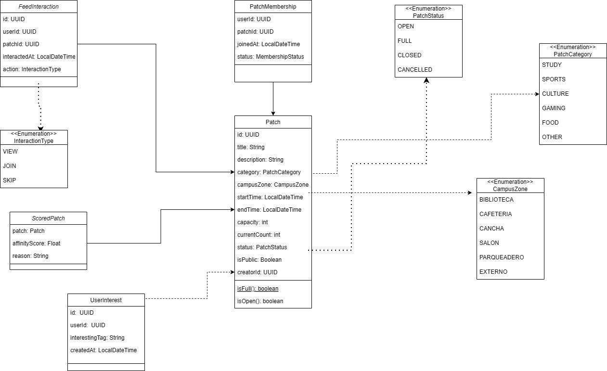
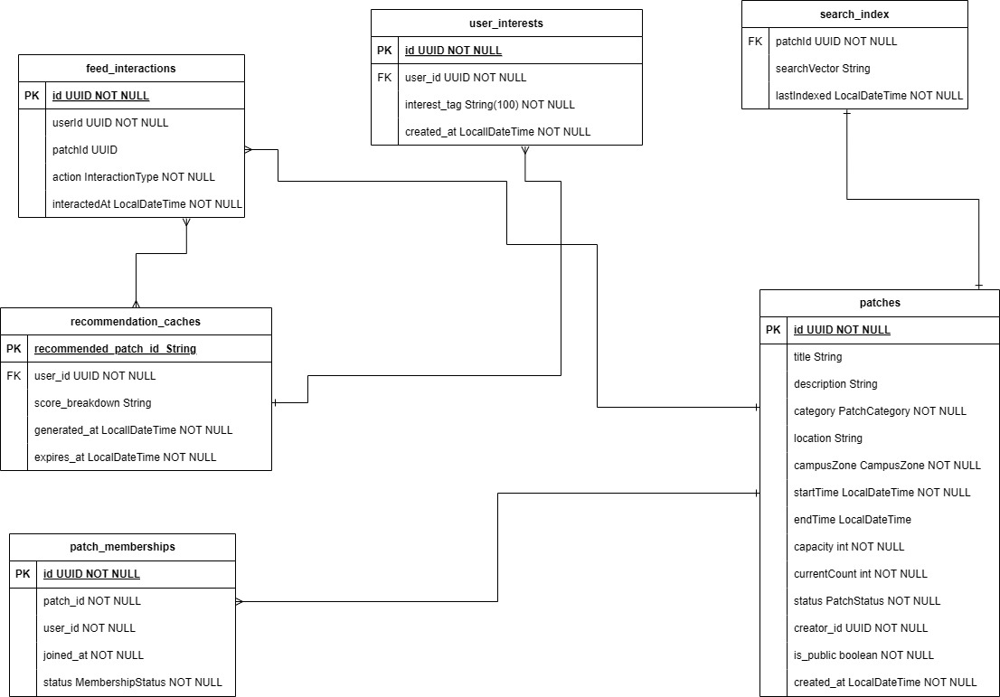
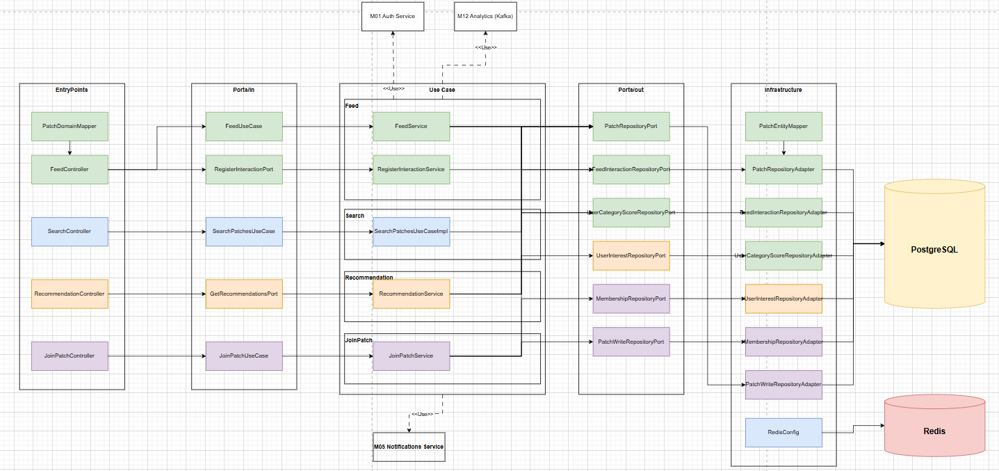

<div align="center">

# Mewtwo-Code — Microservicio de Feed y Búsqueda (M06)

### *"Momentos que inspiran, parches que unen."*

---

### Stack Tecnológico


### Infraestructura & Calidad


### Arquitectura


</div>

---

## Tabla de Contenidos

1. [Integrantes](#1-integrantes)
2. [Tecnologías Utilizadas](#2-tecnologías-utilizadas)
3. [Descripción del Microservicio](#3-descripción-del-microservicio)
4. [Cómo Funciona](#4-cómo-funciona)
5. [Diagrama de Datos](#5-diagrama-de-datos)
6. [Diagrama de Clases](#6-diagrama-de-clases)
7. [Diagrama de Componentes](#7-diagrama-de-componentes)
8. [Funcionalidades Principales](#8-funcionalidades-principales)
9. [Endpoints](#9-endpoints)
10. [Colas de Mensajería](#10-colas-de-mensajería)
11. [Evidencia de Pruebas](#11-evidencia-de-pruebas)
12. [Evidencia de Cobertura](#12-evidencia-de-cobertura)
13. [Cómo Ejecutar](#13-cómo-ejecutar)
14. [Evidencia CI/CD](#14-evidencia-cicd)
15. [Link Swagger](#15-link-swagger)
16. [Estructura del Código](#16-estructura-del-código)
17. [Código Documentado](#17-código-documentado)
18. [Conexiones Externas](#18-conexiones-externas)
19. [Pipeline de Desarrollo](#19-pipeline-de-desarrollo)
20. [Pipeline de Producción](#20-pipeline-de-producción)
21. [Dockerizado](#21-dockerizado)
22. [Versionamiento](#22-versionamiento)

---

## 1. Integrantes

- Juan Esteban Rodriguez
- Fabian Andrade
- Diego Rozo
- Juan David Gomez
- Adrian Ducuara

---

## 2. Tecnologías Utilizadas

| **Tecnología / Herramienta** | **Uso principal en el proyecto** |
|---|---|
| **Java 21 (OpenJDK)** | Lenguaje base con soporte para Spring Boot y Virtual Threads para operaciones I/O eficientes. LTS hasta 2029. |
| **Spring Boot 3.3.0** | Framework principal. Agrupa JPA, Redis, Security y Swagger en un solo ecosistema. |
| **Spring Web** | Exposición de 5 endpoints REST (feed, interact, search, join, recommendations). |
| **Spring Security + OAuth2 Resource Server** | Protección de endpoints mediante JWT. `NimbusJwtDecoder` + `JwtAuthenticationConverter` personalizado. |
| **Spring Data JPA** | Acceso a PostgreSQL con `JpaSpecificationExecutor` para búsquedas dinámicas y filtros acumulables. |
| **PostgreSQL 16** | BD relacional principal — parches, membresías, interacciones e intereses de usuario. |
| **Spring Data Redis** | Caché distribuida para resultados de feed y recomendaciones. TTL 5 minutos. Solo activo en perfil `docker`. |
| **Apache Maven** | Gestión de dependencias y automatización de builds. |
| **Lombok 1.18.46** | Reducción de boilerplate con `@Getter`, `@Builder`, `@NoArgsConstructor`, `@AllArgsConstructor`. |
| **H2** | BD en memoria para pruebas unitarias y perfil dev. Sin PostgreSQL ni Redis. |
| **JUnit 5** | Framework de pruebas unitarias. |
| **Mockito** | Simulación de puertos y repositorios en pruebas sin infraestructura real. |
| **JaCoCo 0.8.12** | Cobertura de pruebas integrada al pipeline CI. |
| **SpringDoc OpenAPI 2.5.0** | Swagger UI en `/swagger-ui.html`. OpenAPI 3 desde anotaciones. |
| **Docker** | Contenedorización. Build multi-etapa con `eclipse-temurin:21-jre-alpine`. |
| **GitHub Actions** | CI: compile → test (JaCoCo) → upload coverage → docker build. |
| **SonarQube** | Análisis estático de calidad de código. |

---

## 3. Descripción del Microservicio

El microservicio de **Feed y Búsqueda** (M06) es el punto de descubrimiento de parches de la plataforma PATRIC.IA. Sus responsabilidades principales son:

- **Feed personalizado:** parches activos y públicos ordenados por score de relevancia (intereses 50% + cercanía temporal 20% + zona del campus 30%).
- **Búsqueda y filtrado:** búsqueda dinámica con hasta 8 filtros acumulables. Respuesta < 1 segundo (RNF01).
- **Recomendaciones:** hasta 10 parches recomendados basados en historial. Para usuarios nuevos retorna los más populares.
- **Unirse a un parche:** valida reglas de negocio (cupo, estado, membresía previa) y notifica a M05.
- **Registro de interacciones:** almacena `VIEW`, `JOIN`, `SKIP` para personalizar el feed y actualizar scores de categoría con decaimiento exponencial.

Puerto: `8081`. Integrado con **Redis** (caché, perfil docker) y **PostgreSQL** como BD principal.

---

## 4. Cómo Funciona

### Arquitectura Hexagonal (Ports & Adapters)

```
┌─────────────────────────────────────────────────────┐
│                  EXTERIOR                           │
│  ┌──────────────┐         ┌──────────────────────┐  │
│  │  Controllers │         │  JPA Adapters        │  │
│  │  (REST)      │         │  Redis Adapter       │  │
│  │  Port In ──► │         │  M05 HTTP Client     │  │
│  └──────┬───────┘         └────────────┬─────────┘  │
│         │          DOMINIO             │ ◄ Port Out  │
│         ▼   ┌────────────────────┐    │             │
│         └──►│  Application       │◄───┘             │
│             │  Services          │                   │
│             └────────────────────┘                   │
└─────────────────────────────────────────────────────┘
```

**Flujo de dependencias:** `Entrypoints / Infrastructure → Application → Domain`

### Algoritmo de Scoring del Feed

```
affinityScore = interestScore * 0.50 + temporalScore

interestScore = min(catScore / 100, 1.0)
  catScore: score de categoría del usuario [0, 100]

temporalScore:
  < 24 horas  → 0.20
  < 72 horas  → 0.15
  < 168 horas → 0.10
  < 720 horas → 0.05
  resto       → 0.00
```

### Scoring de Categorías (Interacciones)

```
Pesos de eventos:
  VIEW → +0.1     JOIN → +1.0     SKIP → -10.0

Decaimiento exponencial (temporal):
  score_nuevo = score_actual × e^(-0.01 × días)
  Rango: [0, 100]
```

### Patrones de Diseño

| Patrón | Ubicación | Descripción |
|---|---|---|
| **Ports & Adapters** | Toda la arquitectura | 5 puertos de entrada + 5 de salida. |
| **Specification** | `PatchSpecification` | 8 predicados combinables dinámicamente para búsqueda (`JpaSpecificationExecutor`). |
| **Strategy** | `FeedService`, `RecommendationService` | Estrategia de scoring intercambiable. |
| **Builder** | Todos los modelos y DTOs | Lombok `@Builder` en todas las entidades de dominio. |
| **Value Object** | `ScoredPatch` | Inmutable: combina `Patch` + `affinityScore` + `reason`. |
| **Popular Fallback** | `RecommendationService` | Sin historial → retorna parches populares con `POPULAR_FALLBACK_SCORE = 0.30`. |

### Conexión con Otros Módulos

| Módulo | Protocolo | Dirección | Dato |
|---|---|---|---|
| M01 — Autenticación | JWT (validación local) | M01 → M06 | M06 valida el JWT de M01 localmente. Extrae `userId`. |
| M05 — Notificaciones | HTTP REST | M06 → M05 | Al hacer `JOIN`, M06 notifica a M05 vía HTTP para enviar notificación al creador del parche. |
| M12 — Estadísticas | Kafka (publicación) | M06 → Kafka → M12 | M06 publica `MetricEvent` con `JOIN`/`LEAVE`/`VIEW` para que M12 actualice métricas. |

---

## 5. Diagrama de Datos

<div align="center">

</div>

### Tabla: `patches`

| Campo | Tipo | Descripción | Restricciones |
|---|---|---|---|
| **id** | `UUID` | Identificador único del parche | PK |
| **title** | `VARCHAR(80)` | Título del parche | NOT NULL |
| **description** | `TEXT` | Descripción detallada | Nullable |
| **category** | `VARCHAR(20)` | STUDY, SPORTS, CULTURE, GAMING, FOOD, OTHER | NOT NULL |
| **campus_zone** | `VARCHAR(20)` | BIBLIOTECA, CAFETERIA, CANCHA, SALON, PARQUEADERO, EXTERNO | NOT NULL |
| **start_time** | `TIMESTAMP` | Fecha y hora de inicio | NOT NULL |
| **end_time** | `TIMESTAMP` | Fecha y hora de fin | Nullable |
| **capacity** | `INTEGER` | Cupo máximo | NOT NULL |
| **current_count** | `INTEGER` | Participantes actuales | NOT NULL, DEFAULT 0 |
| **status** | `VARCHAR(20)` | OPEN, CLOSED, CANCELLED | NOT NULL, DEFAULT 'OPEN' |
| **creator_id** | `UUID` | ID del creador | NOT NULL |
| **is_public** | `BOOLEAN` | Visibilidad | NOT NULL, DEFAULT true |
| **created_at** | `TIMESTAMP` | Fecha de creación | NOT NULL, auto `@PrePersist` |

### Tabla: `patch_memberships`

| Campo | Tipo | Descripción | Restricciones |
|---|---|---|---|
| **id** | `UUID` | Identificador único | PK |
| **patch_id** | `UUID` | Parche al que pertenece | FK → patches(id) |
| **user_id** | `UUID` | ID del usuario miembro | NOT NULL |
| **status** | `VARCHAR(20)` | ACTIVE, CANCELLED | NOT NULL |
| **joined_at** | `TIMESTAMP` | Fecha de ingreso | NOT NULL |

### Tabla: `feed_interactions`

| Campo | Tipo | Descripción | Restricciones |
|---|---|---|---|
| **id** | `UUID` | Identificador único | PK |
| **user_id** | `UUID` | ID del usuario | NOT NULL |
| **patch_id** | `UUID` | ID del parche | NOT NULL |
| **interaction_type** | `VARCHAR(10)` | VIEW, JOIN, SKIP | NOT NULL |
| **created_at** | `TIMESTAMP` | Fecha de la interacción | NOT NULL |

### Tabla: `user_interests`

| Campo | Tipo | Descripción | Restricciones |
|---|---|---|---|
| **id** | `UUID` | Identificador único | PK |
| **user_id** | `UUID` | ID del usuario | NOT NULL |
| **category** | `VARCHAR(20)` | Categoría de interés | NOT NULL |

### Tabla: `user_category_scores`

| Campo | Tipo | Descripción | Restricciones |
|---|---|---|---|
| **id** | `UUID` | Identificador único | PK |
| **user_id** | `UUID` | ID del usuario | NOT NULL |
| **category** | `VARCHAR(20)` | Categoría | NOT NULL |
| **score_total** | `FLOAT` | Score acumulado [0, 100] | NOT NULL |
| **last_updated** | `TIMESTAMP` | Última actualización | NOT NULL |

---

## 6. Diagrama de Clases

<div align="center">

</div>

**Resumen del diseño de dominio:**

- **`Patch`** — entidad central: `title`, `category`, `campusZone`, `startTime`, `capacity`, `currentCount`, `status`, `isPublic`. Lógica: `isFull()`, `isOpen()`.
- **`PatchMembership`** — vincula usuario con parche. `MembershipStatus`: ACTIVE, CANCELLED.
- **`FeedInteraction`** — registra `VIEW`, `JOIN`, `SKIP` para alimentar el motor de scoring.
- **`UserInterest`** — almacena categorías de interés del usuario.
- **`UserCategoryScore`** — score de interés por categoría con decaimiento exponencial.
- **`ScoredPatch`** — value object: `Patch` + `affinityScore` + `reason` (para recomendaciones).

---

## 7. Diagrama de Componentes




| Componente | Tipo | Interfaz |
|---|---|---|
| `FeedController` | REST Controller | `GET /api/v1/feed/parches`, `POST /api/v1/feed/parches/{id}/interact` |
| `SearchController` | REST Controller | `GET /api/v1/parches/search` |
| `JoinPatchController` | REST Controller | `POST /api/v1/feed/{id}/join` |
| `RecommendationController` | REST Controller | `GET /api/v1/feed/recommended` |
| `FeedService` | Application Service | Puerto: `FeedUseCase` |
| `RecommendationService` | Application Service | Puerto: `GetRecommendationsPort` |
| `JoinPatchService` | Application Service | Puerto: `JoinPatchUseCase` |
| `RegisterInteractionService` | Application Service | Puerto: `RegisterInteractionPort` |
| `SearchPatchesUseCaseImpl` | Use Case | Puerto: `SearchPatchesUseCase` |
| `PatchRepositoryAdapter` | JPA Adapter | Puerto: `PatchRepositoryPort` |
| `MembershipRepositoryAdapter` | JPA Adapter | Puerto: `MembershipRepositoryPort` |
| `PatchSpecification` | Specification | 8 predicados dinámicos para `JpaSpecificationExecutor` |

---

## 8. Funcionalidades Principales

<div align="center">

| ID | RF | Funcionalidad | Descripción |
|---|---|---|---|
| F01 | RF14 | **Feed Personalizado** | Parches activos y públicos ordenados por score de relevancia. Caché Redis TTL 5 min. Paginado. |
| F02 | RF15 | **Registro de Interacciones** | Registra `VIEW`, `JOIN`, `SKIP`. Actualiza `UserCategoryScore` con decaimiento exponencial. |
| F03 | RF18 | **Búsqueda y Filtrado** | 8 filtros acumulables vía `PatchSpecification`. Respuesta < 1 segundo. |
| F04 | RF16 | **Recomendaciones** | Hasta 10 parches por score de afinidad. Fallback a populares para usuarios sin historial. |
| F05 | RF17 | **Unirse a un Parche** | Valida cupo + estado + no-membresía. Crea membresía. Notifica a M05. |

</div>

---

## 9. Endpoints

### Resumen

| Método | Endpoint | Funcionalidad | Rol | Código exitoso |
|---|---|---|---|---|
| `GET` | `/api/v1/feed/parches` | F01 — Feed personalizado | JWT autenticado | 200 OK |
| `POST` | `/api/v1/feed/parches/{id}/interact` | F02 — Registrar interacción | JWT autenticado | 204 No Content |
| `GET` | `/api/v1/parches/search` | F03 — Búsqueda | JWT autenticado | 200 OK |
| `GET` | `/api/v1/feed/recommended` | F04 — Recomendaciones | JWT autenticado | 200 OK |
| `POST` | `/api/v1/feed/{id}/join` | F05 — Unirse | JWT autenticado | 200 OK |

---

### GET /api/v1/feed/parches — Feed Personalizado

**Request:**
```
GET /api/v1/feed/parches?userId=550e8400-...&page=0&size=20
Authorization: Bearer <JWT>
```

**Response 200 OK:**
```json
[
  {
    "id": "770e8400-e29b-41d4-a716-446655440000",
    "title": "Parche de estudio cálculo",
    "category": "STUDY",
    "campusZone": "BIBLIOTECA",
    "startTime": "2026-06-15T14:00:00",
    "capacity": 10,
    "currentCount": 4,
    "affinityScore": 0.87,
    "isMember": false
  }
]
```

**Errores:**

| HTTP | Escenario | Mensaje |
|:---:|---|---|
| 401 | JWT inválido o ausente | `"JWT inválido o ausente"` |
| 503 | Servicio dependiente no disponible | `"SERVICE_UNAVAILABLE"` |

---

### POST /api/v1/feed/parches/{patchId}/interact — Registrar Interacción

**Request:**
```json
{
  "action": "VIEW"
}
```

| Campo | Tipo | Restricciones |
|---|---|---|
| `patchId` | UUID | Path param, obligatorio |
| `userId` | UUID | Query param, obligatorio |
| `action` | Enum | Body, obligatorio: `VIEW`, `JOIN`, `SKIP` |

**Errores:**

| HTTP | Escenario | Mensaje |
|:---:|---|---|
| 400 | Acción nula o inválida | `"VALIDATION_ERROR: action: Defina al menos una acción"` |
| 401 | JWT inválido o ausente | `"JWT inválido o ausente"` |

---

### GET /api/v1/parches/search — Búsqueda y Filtrado

**Parámetros (todos opcionales excepto `userId`):**

| Campo | Tipo | Descripción |
|---|---|---|
| `userId` | UUID | Obligatorio |
| `q` | String | Texto en título y descripción (mín. 2 caracteres) |
| `category` | Enum | STUDY, SPORTS, CULTURE, GAMING, FOOD, OTHER |
| `campusZone` | Enum | BIBLIOTECA, CAFETERIA, CANCHA, SALON, PARQUEADERO, EXTERNO |
| `status` | Enum | OPEN, CLOSED, CANCELLED |
| `dateFrom` / `dateTo` | LocalDate | Rango de fechas |
| `maxGroupSize` | Integer | Capacidad máxima |
| `hasAvailableSpots` | Boolean | Solo con cupos disponibles |
| `page` / `size` | Integer | Paginación (default: 0 / 20) |

**Response 200 OK:**
```json
{
  "content": [{ "id": "...", "title": "Fútbol 5 tarde", "category": "SPORTS" }],
  "page": 0, "size": 20, "totalElements": 1, "totalPages": 1, "hasNext": false
}
```

**Errores:**

| HTTP | Escenario | Mensaje |
|:---:|---|---|
| 400 | `q` < 2 caracteres | `"VALIDATION_ERROR: q: El término de búsqueda debe tener al menos 2 caracteres"` |
| 401 | JWT inválido | `"JWT inválido o ausente"` |

---

### GET /api/v1/feed/recommended — Recomendaciones

**Request:**
```
GET /api/v1/feed/recommended?userId=550e8400-...
Authorization: Bearer <JWT>
```

**Response 200 OK:**
```json
[
  {
    "patchId": "770e8400-...",
    "patch": { "title": "Jam de música", "category": "CULTURE" },
    "affinityScore": 0.92,
    "reason": "Basado en tus intereses"
  }
]
```

---

### POST /api/v1/feed/{patchId}/join — Unirse a un Parche

**Request:**
```
POST /api/v1/feed/770e8400-.../join?userId=550e8400-...
Authorization: Bearer <JWT>
```

**Errores:**

| HTTP | Escenario | Mensaje |
|:---:|---|---|
| 404 | Parche no encontrado | `"PATCH_NOT_FOUND"` |
| 422 | Parche lleno o cerrado | `"BUSINESS_RULE_VIOLATION"` |
| 422 | Usuario ya es miembro | `"BUSINESS_RULE_VIOLATION"` |
| 401 | JWT inválido | `"JWT inválido o ausente"` |

---

## 10. Colas de Mensajería


---

## 11. Evidencia de Pruebas

### Clases de prueba implementadas

```
src/test/java/edu/eci/patricia/
├── application/service/
│   ├── FeedServiceTest.java           → Feed con scoring y paginación
│   └── RecommendationServiceTest.java → Motor de recomendaciones y fallback popular
└── application/usecase/
    └── SearchPatchesUseCaseTest.java  → Búsqueda con filtros dinámicos
```

### Cómo ejecutar las pruebas

```bash
# Pruebas unitarias
./mvnw test

# Todas las pruebas + reporte JaCoCo
./mvnw verify

# Reporte de cobertura
./mvnw clean test jacoco:report
# → target/site/jacoco/index.html

# Prueba específica
./mvnw test -Dtest=FeedServiceTest
./mvnw test -Dtest=RecommendationServiceTest
./mvnw test -Dtest=SearchPatchesUseCaseTest
```


---

## 12. Evidencia de Cobertura

Cobertura mínima esperada: `FeedService` > 80%, `RecommendationService` > 80%, `SearchPatchesUseCaseImpl` > 80%.

---

## 13. Cómo Ejecutar

### Prerrequisitos

- Java 21
- Maven 3.9+
- Docker & Docker Compose (solo para modo Docker)

### Opción 1: Local con Maven (perfil `dev`, H2 sin Docker)

```bash
# Clonar repositorio
git clone https://github.com/<org>/mewtwocode-feed-search-service.git

# Ejecutar sin Docker (H2 en memoria, Redis desactivado)
./mvnw spring-boot:run
```

**URL:** `http://localhost:8081`
**Swagger UI:** `http://localhost:8081/swagger-ui.html`

### Opción 2: Docker Compose (PostgreSQL + Redis)

```bash
docker compose up --build
```

### Variables de Entorno

| Variable | Valor por defecto | Descripción |
|---|---|---|
| `SPRING_DATASOURCE_URL` | `jdbc:postgresql://localhost:5432/m06_feed` | URL de PostgreSQL |
| `SPRING_DATASOURCE_USERNAME` | `patricia` | Usuario |
| `SPRING_DATASOURCE_PASSWORD` | `patricia` | Contraseña |
| `SPRING_DATA_REDIS_HOST` | `localhost` | Host de Redis |
| `SPRING_DATA_REDIS_PORT` | `6379` | Puerto de Redis |
| `SPRING_SECURITY_OAUTH2_RESOURCESERVER_JWT_SECRET` | `patriciasecret` | Secreto JWT |
| `PORT` | `8081` | Puerto del servidor |

---

## 14. Evidencia CI/CD


El pipeline `.github/workflows/ci.yml` corre en cada push a `main`, `develop` o `feature/**`:

1. **Checkout** — `actions/checkout@v4`
2. **Java 21** — `actions/setup-java@v4` (Temurin)
3. **Cache Maven** — dependencias cacheadas para acelerar el build
4. **Compilar** — `./mvnw compile`
5. **Tests** — `./mvnw test`
6. **Docker Build** — construye imagen `m06-feed-busqueda:{sha}`

---

## 15. Link Swagger

| Ambiente | URL |
|---|---|
| Local (Maven) | http://localhost:8081/swagger-ui.html |
| Docker Compose | http://localhost:8080/swagger-ui.html |
| OpenAPI JSON | http://localhost:8081/v3/api-docs |

> Usar **Bearer JWT** en el botón "Authorize" de Swagger UI para probar endpoints protegidos.

---

## 16. Estructura del Código

```
mewtwocode-feed-search-service/
├── src/
│   ├── main/
│   │   ├── java/edu/eci/patricia/
│   │   │   ├── domain/                              # CAPA DE DOMINIO (sin imports de Spring)
│   │   │   │   ├── model/
│   │   │   │   │   ├── Patch.java                   (isFull(), isOpen())
│   │   │   │   │   ├── PatchMembership.java
│   │   │   │   │   ├── FeedInteraction.java
│   │   │   │   │   ├── UserInterest.java
│   │   │   │   │   ├── UserCategoryScore.java
│   │   │   │   │   └── enums/
│   │   │   │   │       ├── CampusZone.java
│   │   │   │   │       ├── InteractionType.java     (VIEW, JOIN, SKIP)
│   │   │   │   │       ├── MembershipStatus.java
│   │   │   │   │       ├── PatchCategory.java
│   │   │   │   │       └── PatchStatus.java
│   │   │   │   ├── ports/
│   │   │   │   │   ├── in/
│   │   │   │   │   │   ├── FeedUseCase.java
│   │   │   │   │   │   ├── GetRecommendationsPort.java
│   │   │   │   │   │   ├── JoinPatchUseCase.java
│   │   │   │   │   │   ├── RegisterInteractionPort.java
│   │   │   │   │   │   └── SearchPatchesUseCase.java
│   │   │   │   │   └── out/
│   │   │   │   │       ├── FeedInteractionRepositoryPort.java
│   │   │   │   │       ├── MembershipRepositoryPort.java
│   │   │   │   │       ├── PatchRepositoryPort.java
│   │   │   │   │       ├── PatchWriteRepositoryPort.java
│   │   │   │   │       └── UserInterestRepositoryPort.java
│   │   │   │   ├── exceptions/
│   │   │   │   │   ├── AlreadyMemberException.java
│   │   │   │   │   ├── BusinessRuleException.java
│   │   │   │   │   ├── PatchFullException.java
│   │   │   │   │   ├── PatchNotFoundException.java
│   │   │   │   │   └── ServiceUnavailableException.java
│   │   │   │   └── valueobjects/
│   │   │   │       └── ScoredPatch.java             (Patch + affinityScore + reason)
│   │   │   │
│   │   │   ├── application/                         # CAPA DE APLICACION
│   │   │   │   ├── service/
│   │   │   │   │   ├── FeedService.java             (INTEREST_SCORE=0.50, TEMPORAL_MAX=0.20)
│   │   │   │   │   ├── JoinPatchService.java
│   │   │   │   │   ├── RecommendationService.java   (MAX=10, FALLBACK_SCORE=0.30)
│   │   │   │   │   └── RegisterInteractionService.java (LAMBDA=0.01, VIEW=+0.1, JOIN=+1.0, SKIP=-10.0)
│   │   │   │   ├── usecase/
│   │   │   │   │   └── SearchPatchesUseCaseImpl.java
│   │   │   │   ├── mapper/
│   │   │   │   │   └── PatchDomainMapper.java
│   │   │   │   └── dto/
│   │   │   │       ├── request/
│   │   │   │       │   ├── InteractRequest.java
│   │   │   │       │   └── SearchRequest.java
│   │   │   │       └── response/
│   │   │   │           ├── PatchSummaryResponse.java
│   │   │   │           ├── PatchRecommendationResponse.java
│   │   │   │           └── SearchResponse.java
│   │   │   │
│   │   │   ├── infrastructure/                      # CAPA DE INFRAESTRUCTURA
│   │   │   │   ├── adapters/
│   │   │   │   │   ├── adapter/
│   │   │   │   │   │   ├── FeedInteractionRepositoryAdapter.java
│   │   │   │   │   │   ├── MembershipRepositoryAdapter.java
│   │   │   │   │   │   ├── PatchRepositoryAdapter.java
│   │   │   │   │   │   ├── PatchWriteRepositoryAdapter.java
│   │   │   │   │   │   └── UserInterestRepositoryAdapter.java
│   │   │   │   │   └── persistence/
│   │   │   │   │       ├── PatchSpecification.java  (8 predicados dinámicos)
│   │   │   │   │       ├── entity/
│   │   │   │   │       │   ├── PatchEntity.java
│   │   │   │   │       │   ├── PatchMembershipEntity.java
│   │   │   │   │       │   ├── FeedInteractionEntity.java
│   │   │   │   │       │   └── UserInterestEntity.java
│   │   │   │   │       ├── mapper/
│   │   │   │   │       │   └── PatchEntityMapper.java
│   │   │   │   │       └── repository/
│   │   │   │   │           ├── PatchJpaRepository.java
│   │   │   │   │           ├── PatchMembershipJpaRepository.java
│   │   │   │   │           ├── FeedInteractionJpaRepository.java
│   │   │   │   │           └── UserInterestJpaRepository.java
│   │   │   │   └── config/
│   │   │   │       ├── RedisConfig.java             (@Profile("docker"))
│   │   │   │       ├── SecurityConfig.java          (JWT OAuth2 Resource Server)
│   │   │   │       ├── SwaggerConfig.java
│   │   │   │       └── WebConfig.java
│   │   │   │
│   │   │   ├── entrypoints/                         # CONTROLADORES REST
│   │   │   │   ├── advice/
│   │   │   │   │   └── GlobalExceptionHandler.java
│   │   │   │   └── rest/controller/
│   │   │   │       ├── FeedController.java
│   │   │   │       ├── SearchController.java
│   │   │   │       ├── JoinPatchController.java
│   │   │   │       └── RecommendationController.java
│   │   │   │
│   │   │   └── PatriciaApplication.java
│   │   │
│   │   └── resources/
│   │       ├── application.properties               (puerto 8081, H2 default)
│   │       └── application-local.properties
│   │
│   └── test/
│       └── java/edu/eci/patricia/application/
│           ├── service/
│           │   ├── FeedServiceTest.java
│           │   └── RecommendationServiceTest.java
│           └── usecase/
│               └── SearchPatchesUseCaseTest.java
│
├── docs/
│   ├── DiagramaContexto.png
│   ├── Diagrama_Clases.jpg
│   ├── Diagrama_Despliegue.jpg
│   └── Diagrama_Entidad.jpg
│
├── .github/workflows/ci.yml
├── Dockerfile
├── docker-compose.yml
├── pom.xml
├── seed.sql
└── README.md
```

---

## 17. Código Documentado


Ejemplo de documentación en `FeedService`:

```java
/**
 * Calcula el score de relevancia combinando interés del usuario (50%)
 * y cercanía temporal del parche (hasta 20%).
 * Score = min(catScore/100, 1.0) * 0.50 + temporalScore
 */
private double scoreRelevance(Patch patch, float catScore) { ... }

/**
 * Score temporal según antigüedad del parche:
 * < 24h → 0.20 | < 72h → 0.15 | < 168h → 0.10 | < 720h → 0.05 | else → 0.0
 */
private double temporalScore(Patch patch) { ... }
```

---

## 18. Conexiones Externas

| Módulo | Tipo | Dirección | Detalle |
|---|---|---|---|
| **M01 — Autenticación** | JWT (validación local) | M01 → M06 | `SecurityConfig` configura `NimbusJwtDecoder`. Extrae `userId` del claim `sub`. Sin llamada HTTP a M01. |
| **M05 — Notificaciones** | HTTP REST | M06 → M05 | Al hacer `JOIN` exitoso, M06 llama a M05 vía HTTP para notificar al creador del parche. Si M05 no responde → `ServiceUnavailableException`. |
| **M12 — Estadísticas** | Kafka (publicación) | M06 → Kafka → M12 | M06 publica `MetricEvent` con `JOIN`/`LEAVE`/`VIEW` para actualización de métricas en M12. |

**M06 no consume eventos de otros módulos.** Solo publica.

---

## 19. Pipeline de Desarrollo

Perfil: **sin perfil / `local`** — H2 in-memory, Redis desactivado, sin Docker.

```bash
# Levantar en modo desarrollo
./mvnw spring-boot:run

# Redis desactivado (perfil docker no activo → RedisConfig @Profile("docker") no carga)
# H2 Console disponible si está configurado en application.properties

# Ejecutar pruebas
./mvnw test

# Reporte de cobertura
./mvnw clean test jacoco:report
# → target/site/jacoco/index.html
```

**No requiere:** PostgreSQL, Redis, Docker, Kafka.

---

## 20. Pipeline de Producción

Perfil: **`docker`** — PostgreSQL 16 + Redis.

```bash
# Build y levantamiento completo
docker compose up --build

# Solo reconstruir la app
docker compose up --build m06-feed-search

# Ver logs
docker compose logs -f m06-feed-search

# Estado de contenedores
docker compose ps
```

**Servicios en `docker-compose.yml`:**

| Servicio | Imagen | Puerto |
|---|---|---|
| `m06-feed-search` | `eclipse-temurin:21-jre-alpine` | `8081:8081` |
| `postgres` | `postgres:16-alpine` | `5432:5432` |
| `redis` | `redis:7-alpine` | `6379:6379` |

---

## 21. Dockerizado

### Dockerfile (multi-etapa)

```dockerfile
# Etapa 1: Build
FROM maven:3.9.6-eclipse-temurin-21 AS build
WORKDIR /app
COPY pom.xml .
RUN mvn dependency:go-offline -q
COPY src ./src
RUN mvn package -DskipTests -q

# Etapa 2: Runtime (imagen mínima)
FROM eclipse-temurin:21-jre-alpine
WORKDIR /app
COPY --from=build /app/target/*.jar app.jar
EXPOSE 8081
ENTRYPOINT ["java", "-jar", "app.jar", "--spring.profiles.active=docker"]
```

### Comandos Docker

```bash
# Primera vez
docker compose up --build

# Sin rebuild
docker compose up

# Detener y eliminar contenedores
docker compose down

# Eliminar también los volúmenes (BD)
docker compose down -v
```


---

## 22. Versionamiento

### Estrategia de Ramas (Git Flow)

| Rama | Propósito | Reglas |
|---|---|---|
| `main` | Versión estable para demo/producción | Solo merges desde `release/*` y `hotfix/*`. Tag SemVer en cada merge. PR obligatorio + CI verde. |
| `develop` | Integración continua | Recibe merges desde `feature/*` y `release/*`. Rama protegida. |
| `feature/*` | Desarrollo de funcionalidad | Base: `develop`. Se fusiona con PR. |

### Convenciones de Ramas

```
feature/[nombre-funcionalidad]
```

Ejemplos: `feature/feed`, `feature/search`, `feature/Adrian`

### Convenciones de Commits

```
[tipo]: [descripción específica de la acción]
```

| Tipo | Uso |
|---|---|
| `feat` | Nueva funcionalidad |
| `fix` | Corrección de errores |
| `docs` | Cambios en documentación |
| `test` | Agregar o modificar pruebas |
| `refactor` | Refactorización sin cambio de funcionalidad |
| `chore` | Cambios de configuración, dependencias |

---

<div align="center">

### Equipo **Mewtwo-Code**


> **PATRIC.IA Feed & Search Service** — punto central de descubrimiento de parches, diseñado para responder en menos de 1 segundo con recomendaciones personalizadas y búsqueda en tiempo real.

**Escuela Colombiana de Ingeniería Julio Garavito**

</div>
